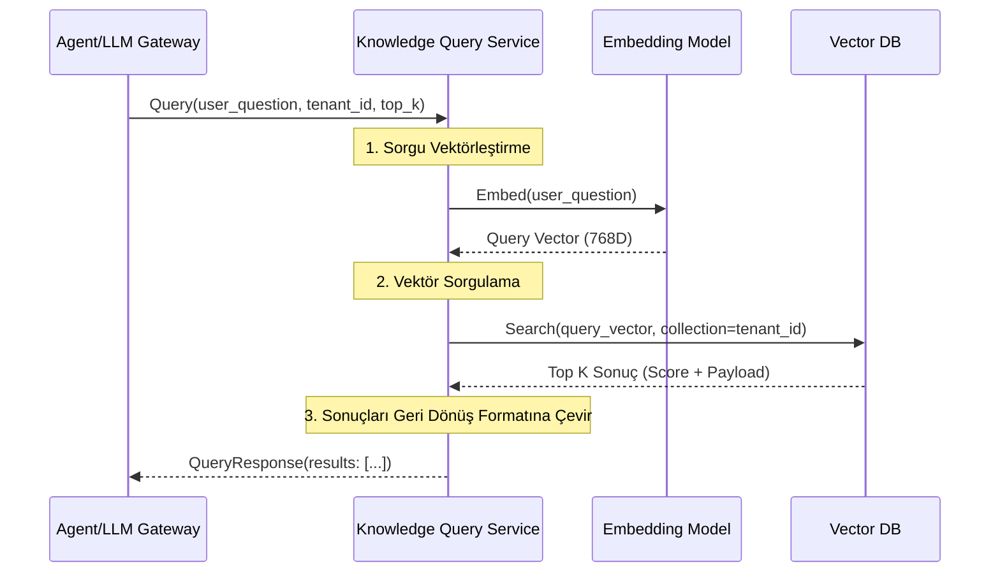

# 📚 Sentiric Knowledge Query Service - Mantık ve Akış Mimarisi

**Stratejik Rol:** RAG (Retrieval Augmented Generation) mimarisinin "Okuma" (Query) bacağını temsil eder. Gelen doğal dil sorgularını alır, bunları vektörleştirir ve en alakalı kurumsal bilgiyi (Context) Vector Database'ten çeker.

---

## 1. CQRS Mimarisi ve Okuma Akışı

Bu servis sadece **Okuma (Query)** işlemlerinden sorumludur. Yazma (Indexing) işlemleri ayrı bir servistedir.

## 2. Optimizasyon
* Caching: Sık sorulan soruların (Q/A çiftleri) sonucunu Redis'te önbelleğe almak kritik performans kazancı sağlar.
* Agnostik DB: Sadece Qdrant Client'ını kullanır, böylece alt katman (Vector DB) değişse bile RPC kontratı aynı kalır.