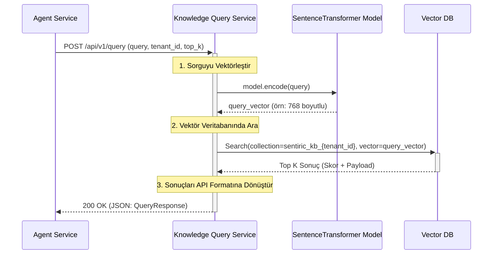
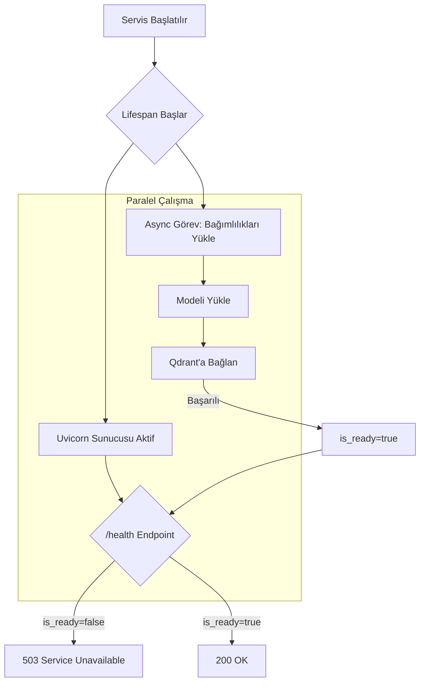

# 📚 Sentiric Knowledge Query Service - Mantık ve Akış Mimarisi

**Stratejik Rol:** RAG (Retrieval-Augmented Generation) mimarisinin "Okuma" (Query) bacağını temsil eder. Gelen doğal dil sorgularını alır, bunları vektörleştirir ve en alakalı kurumsal bilgiyi (Context) Vector Database'ten çeker.

---

## 1. CQRS Mimarisi ve Okuma Akışı

Bu servis sadece **Okuma (Query)** işlemlerinden sorumludur. Yazma (Indexing) işlemleri `knowledge-indexing-service` tarafından yürütülür.

## 2. Başlangıç (Startup) ve Sağlık Kontrolü Mantığı

Servis, Uvicorn sunucusunun hızlıca başlamasını sağlarken, ağır bağımlılıkları arka planda yükler. Bu, Kubernetes gibi orkestrasyon araçlarının servisi "canlı" olarak görmesini, ancak "hazır" olmadan trafik yönlendirmemesini sağlar.

## 3. Optimizasyon Stratejileri

*   **Caching:** Sık sorulan soruların (Q/A çiftleri) sonucunu Redis'te önbelleğe almak, hem Qdrant hem de Embedding modeli üzerindeki yükü azaltarak performansı artırabilir. (Bonus olarak belirtildi, gelecekte eklenebilir).
*   **Agnostik DB:** Sadece `qdrant-client` kütüphanesini kullanır, böylece alttaki Vector DB değişse bile (örn: Weaviate, Milvus) servis mantığı ve API kontratı aynı kalır.
