# 📚 Sentiric Knowledge Query Service - Mantık ve Akış Mimarisi

**Stratejik Rol:** RAG (Retrieval-Augmented Generation) mimarisinin "Okuma" (Query) bacağını temsil eder. Gelen doğal dil sorgularını alır, bunları vektörleştirir ve en alakalı kurumsal bilgiyi (Context) Vector Database'ten çeker.

---

## 1. CQRS Mimarisi ve Okuma Akışı

Bu servis sadece **Okuma (Query)** işlemlerinden sorumludur. Yazma (Indexing) işlemleri `knowledge-indexing-service` tarafından yürütülür.

```mermaid
sequenceDiagram
    participant Agent as Agent Service
    participant QueryService as Knowledge Query Service
    participant Embedding as SentenceTransformer Model
    participant Qdrant as Vector DB

    Agent->>+QueryService: POST /api/v1/query (query, tenant_id, top_k)
    
    Note over QueryService: 1. Sorguyu Vektörleştir
    QueryService->>Embedding: model.encode(query)
    Embedding-->>QueryService: query_vector (örn: 768 boyutlu)
    
    Note over QueryService: 2. Vektör Veritabanında Ara
    QueryService->>+Qdrant: Search(collection=sentiric_kb_{tenant_id}, vector=query_vector)
    Qdrant-->>-QueryService: Top K Sonuç (Skor + Payload)
    
    Note over QueryService: 3. Sonuçları API Formatına Dönüştür
    QueryService-->>-Agent: 200 OK (JSON: QueryResponse)
```

## 2. Başlangıç (Startup) ve Sağlık Kontrolü Mantığı

Servis, Uvicorn sunucusunun hızlıca başlamasını sağlarken, ağır bağımlılıkları arka planda yükler. Bu, Kubernetes gibi orkestrasyon araçlarının servisi "canlı" olarak görmesini, ancak "hazır" olmadan trafik yönlendirmemesini sağlar.

```mermaid
graph TD
    A[Servis Başlatılır] --> B{Lifespan Başlar};
    B --> C[Uvicorn Sunucusu Aktif];
    B --> D[Async Görev: Bağımlılıkları Yükle];
    
    subgraph "Paralel Çalışma"
        C --> E{/health Endpoint};
        D --> F[Modeli Yükle];
        F --> G[Qdrant'a Bağlan];
    end
    
    E -- is_ready=false --> H[503 Service Unavailable];
    G -- Başarılı --> I[is_ready=true];
    I --> E;
    E -- is_ready=true --> J[200 OK];
```

## 3. Optimizasyon Stratejileri

*   **Caching:** Sık sorulan soruların (Q/A çiftleri) sonucunu Redis'te önbelleğe almak, hem Qdrant hem de Embedding modeli üzerindeki yükü azaltarak performansı artırabilir. (Bonus olarak belirtildi, gelecekte eklenebilir).
*   **Agnostik DB:** Sadece `qdrant-client` kütüphanesini kullanır, böylece alttaki Vector DB değişse bile (örn: Weaviate, Milvus) servis mantığı ve API kontratı aynı kalır.
