# 📚 Sentiric Knowledge Query Service - Mantık ve Akış Mimarisi

**Stratejik Rol:** RAG (Retrieval Augmented Generation) mimarisinin "Okuma" (Query) bacağını temsil eder. Gelen doğal dil sorgularını alır, bunları vektörleştirir ve en alakalı kurumsal bilgiyi (Context) Vector Database'ten çeker.

---

## 1. CQRS Mimarisi ve Okuma Akışı

Bu servis sadece **Okuma (Query)** işlemlerinden sorumludur. Yazma (Indexing) işlemleri ayrı bir servistedir.

```mermaid
sequenceDiagram
    participant Agent as Agent/LLM Gateway
    participant QueryService as Knowledge Query Service
    participant Embedding as Embedding Model
    participant Qdrant as Vector DB
    
    Agent->>QueryService: Query(user_question, tenant_id, top_k)
    
    Note over QueryService: 1. Sorgu Vektörleştirme
    QueryService->>Embedding: Embed(user_question)
    Embedding-->>QueryService: Query Vector (768D)
    
    Note over QueryService: 2. Vektör Sorgulama
    QueryService->>Qdrant: Search(query_vector, collection=tenant_id)
    Qdrant-->>QueryService: Top K Sonuç (Score + Payload)
    
    Note over QueryService: 3. Sonuçları Geri Dönüş Formatına Çevir
    QueryService-->>Agent: QueryResponse(results: [...])
```

## 2. Optimizasyon
* Caching: Sık sorulan soruların (Q/A çiftleri) sonucunu Redis'te önbelleğe almak kritik performans kazancı sağlar.
* Agnostik DB: Sadece Qdrant Client'ını kullanır, böylece alt katman (Vector DB) değişse bile RPC kontratı aynı kalır.